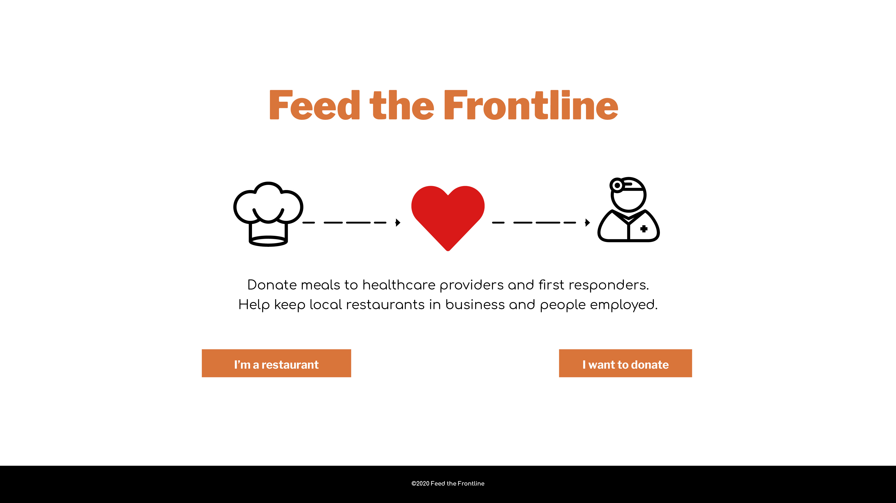

# Feed the Frontline
A Django web application for connecting donors, restaurants and healthcare workers on the frontline

## Design and Development Team
Adrienne Grace, Thomas Dahlberg & Daniel Usem

## Screenshots

## Technologies Used
HTML5, CSS3, PostgreSQL, Python, Django, jQuery, Heroku, Materialize, Google Places API

## Pitch Deck
https://docs.google.com/presentation/d/1u70reJtMoxyudcNyyvaGKvSydfR--OblwXz4aEa79XA/edit#slide=id.g730cce87bd_0_260

## Getting Started
https://trello.com/b/VGtKuk92/feed-the-frontline

Heroku Link

## Future Enhancements

