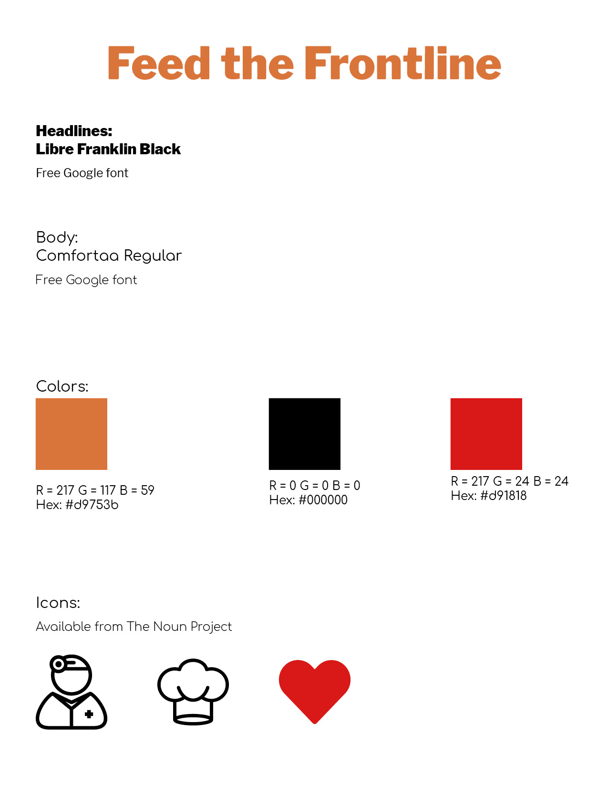

# Feed the Frontline
A Django web application for connecting donors, restaurants and healthcare workers on the frontline.

### Background
Our General Assembly cohort has been together since before COVID-19 emerged. It has offered us a constant while much in our daily lives changed rapidly and dramatically. We were broken into small groups for a final project just 2 weeks into stay-at-home orders for everyone in our cohort. We all wanted to use our new skills to help people and communities around us.

Inspired by conversations with friends in the restaurant and catering business, our team quickly agreed on an app that would support both local restaurants and offer meals to frontline healthcare providers.

> Health care workers, exhausted from pulling long shifts, have little time to eat a good meal.
https://laist.com/2020/03/26/how_you_can_help_feed_socal_healthcare_workers.php

Our model is different than others, in that restaurants can sign up themselves and donors can select which restaurant they'd like to donate to. A bonus for the restaurants — they get a little name recognition that can carry over into new patrons once they can reopen. 

## Design and Development Team
Adrienne Grace, Thomas Dahlberg & Daniel Usem

## Screenshots

## Technologies Used
HTML5, CSS3, PostgreSQL, Python, Django, jQuery, Heroku, Materialize, Google Places API, Google Maps Javascript API, Geolocation API, Paypal

Feed the Frontline (FtF) is a full-stack web application built on the Python-Django framework. It consumes both Google Maps and Google Places APIs to geolocate existing restaurants and healthcare facilities, store them in the database and display them as markers on an interactive map for end users. Leveraging the HTML5 Geolocation API, FtF's clientside locates the browser user and serves them a map of their surrounding area that shows local restaurants and facilities that are participants in FtF.

## Pitch Deck
https://docs.google.com/presentation/d/1u70reJtMoxyudcNyyvaGKvSydfR--OblwXz4aEa79XA/edit#slide=id.g730cce87bd_0_260

## Getting Started
To start using the application navigate to the Heroku Development link below and choose your narrative: Are you a restaurant looking to keep staff employed and healthcare workers fed? Or are you stuck at home, but want to make difference by donating to a local restaurant feeding the frontline? Restauranteurs can quickly register a user account, create a restaurant profile and start meal delivery campaign that they can promote online with a personalized URL. Donators need only peruse a google map of local restaurants and healthcare facilities, pick one, decide how many meals they want to donate and complete a quick Paypal transaction.

https://trello.com/b/VGtKuk92/feed-the-frontline

## Heroku Deployment
http://feed-the-frontline.herokuapp.com/

## Future Enhancements
- Creating a donor user which tracks number of meals donated, which restaurants were donated to, and donation dates.
- Dynamically chart weekly donations against a restaurant's goal numbers in a thermometer-style graph.
- Social media integration